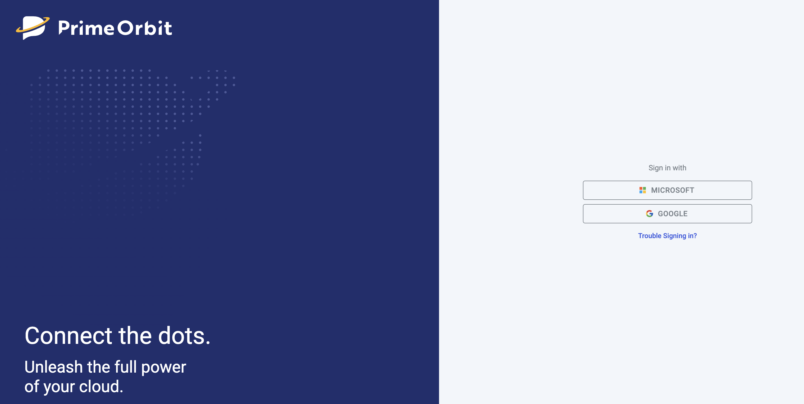

## Authentication

### Azure Entra ID
PrimeOrbit supports authentication using **Azure Entra ID** for secure and seamless user access. Users can log in using their organizational credentials, ensuring compliance with enterprise security policies.

### Google Authentication
Google Authentication is available for users who prefer Google-based sign-in. This method provides a quick and secure way to access PrimeOrbit without managing additional credentials.

# User Experience

## Onboarding Guide

For details on setting up authentication and user access, refer to the [Onboarding](onboarding.md) section.

The onboarding guide provides a step-by-step process for setting up **Azure Entra ID** and **Google Authentication**, ensuring a smooth and secure integration.