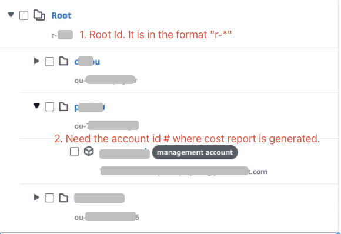

# PrimeOrbit AWS Organizations Account Setup 
To integrate PrimeOrbit with your AWS Organization accounts, follow the setup instructions below. This guide will walk you through deploying a CloudFormation stack to enable the integration.

## Permissions Overview
To understand the permissions PrimeOrbit obtains, please refer to the permissions overview here: [Permission Overview](permissions-overview.md).

## AWS Organizations Account Setup Instructions

1. **Sign in to the Organization Account**:
   - Before starting the setup, sign in to the AWS Management Console as someone with Administrative Priveleges to your AWS organization: [AWS Management Console](https://console.aws.amazon.com/).  

2. Make sure you have activated the **trusted access for stack sets** with Organizations
   - Please see the instructions on how to activate [trusted access with AWS Organizations](https://docs.aws.amazon.com/AWSCloudFormation/latest/UserGuide/stacksets-orgs-activate-trusted-access.html)

3. **Obtain Your Root's Organizational Unit (OU)**
   - Make sure to copy your **root**'s Organizational Unit (OU) ID. You can find this information by following the steps outlined in the [AWS Documentation on Navigating the Root and OU Hierarchy](https://docs.aws.amazon.com/organizations/latest/userguide/navigate_tree.html). 
   - This OU ID will need to be entered in the "OrganizationUnit" parameter during the stack deployment.

4. **Deploy the CloudFormation Stack**: Use the URL below to start the CloudFormation stack creation in the AWS console 

   **CloudFormation Stack URL for Organization Root Account**:
[Deploy Stack](https://us-east-1.console.aws.amazon.com/cloudformation/home?region=us-east-1#/stacks/create/review?templateURL=https://prime-orbit-setup.s3.amazonaws.com/v2/aws-org-root-new-cur-setup-v2.yml&param_TargetAccountId=115525691254&stackName=POKeylessSetupV2R1)

5. **Verify Setup**: After the stack has been deployed, ensure that the setup has completed successfully by checking the status of the execution in the AWS CloudFormation console.

6. **Sharing the following information with PrimeOrbit**: Your Organization Root and the management account where the cost reports are generated.

