# PrimeOrbit GCP Setup Documentation

Welcome to the PrimeOrbit GCP Setup guide! Here you can find all the necessary resources to connect PrimeOrbit with your GCP environments. Follow the relevant guide based on your GCP environment.

## Before you begin

Ensure that you have the following permissions to enable and configure the export of Google Cloud billing data to a BigQuery dataset:

1. <b>Billing Account Administrator</b> role for the target Cloud Billing account
2. <b>BigQuery User role for the Cloud project</b> that contains the BigQuery dataset that will be used to store the Cloud Billing data
3. <b>IAM Admin role</b> to add the service account ID as a member in your GCP project.

## Setup GCP Service Account
Integrating your GCP projects with PrimeOrbit requires you to authorize PrimeOrbit to fetch billing, cost, recommendations, monitoring data from your GCP. You can choose between two authorization methods: Managed Service Account and Unmanaged Service Account.

### OPTION-1 Preferred: Use dedicated PrimeOrbit Service Account
PrimeOrbit manages a specific Google service account per Customer; you do not need to create it or manage the associated private key. Just add the service account ID as a member with viewing permissions in your project. If your organization uses a domain restriction constraint, you will have to update the policy to allow the PrimeOrbit domain, `C03gkjq09`.

Please check with the PrimeOrbit to get the service account ID for your organization.

### OPTION-2 Create Unmanaged Service Account with roles assigned
1. Log into the GCP console.

2. Search for <b>Service Accounts</b>, and click <b>Create New</b>.<br>
-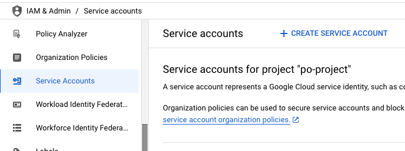

3. Enter the Service Account details:
    - Service Account Name: `primeorbitserviceaccount`
    - Service Account ID: `primeorbitserviceaccount`
    - Description: `primeorbitserviceaccount Access`
    - 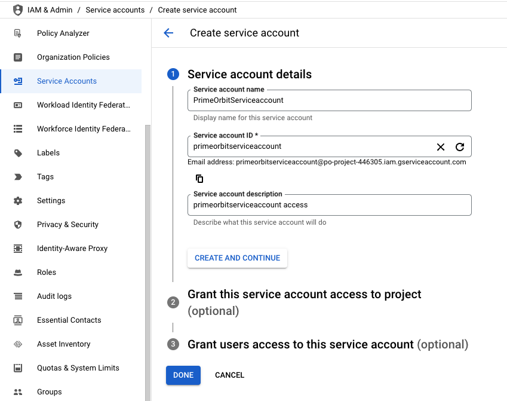
    
3. Click `CREATE AND CONTINUE`
4. Click `Done`
1. Click on the three dots next to the service account and choose Manage Keys
    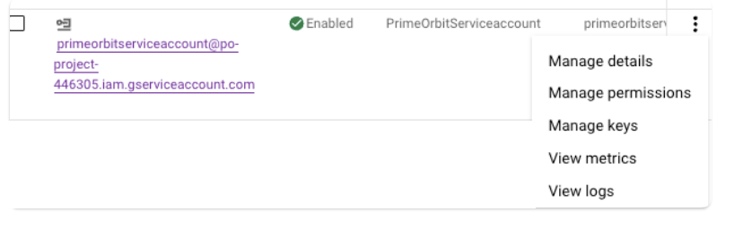
    1. Click `ADD KEY` --> `Create new key` and choose JSON <br>
        - Click `CREATE` and save the JSON file. You will need to share this file with PrimeOrbit.
        <br>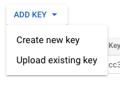

## Create Detailed Usage Cost Dataset
Please follow the [instructions](https://cloud.google.com/billing/docs/how-to/export-data-bigquery-setup) from Google to get it done.
The first step is to configure your Cloud Billing Data Exports in the Google Cloud console. You may already have completed these steps for other purposes, but please confirm the steps here match what you have previously set up.

**Google recommends creating a dedicated project for billing data.

1. select <b>Launch GCP console</b>
2. In the Google Cloud account, select <b>Billing --> Billing Export</b>.<br>
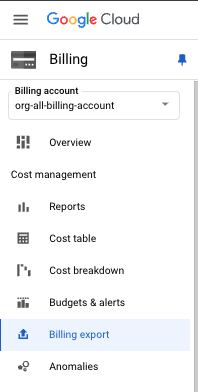
3. Click on <b>Edit settings</b> under Detailed usage cost <br>
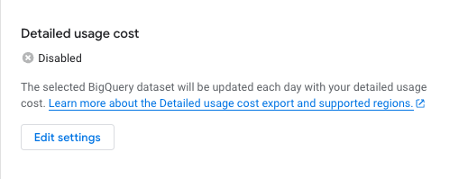
3. Select the right Project and Dataset.<br>
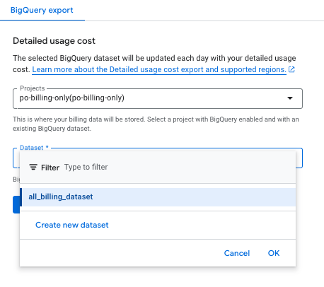
3. Create a new dataset if there isn't one already.
    - Enter a `Dataset ID` as `all_billing_dataset`.
    - Select a `Data location`.
    - Set the `Default table expiration` to <b>Never</b>.
    - Set the `Encryption option` to <b>Google-managed key</b>.
    * Make sure you select the right project.<br>
    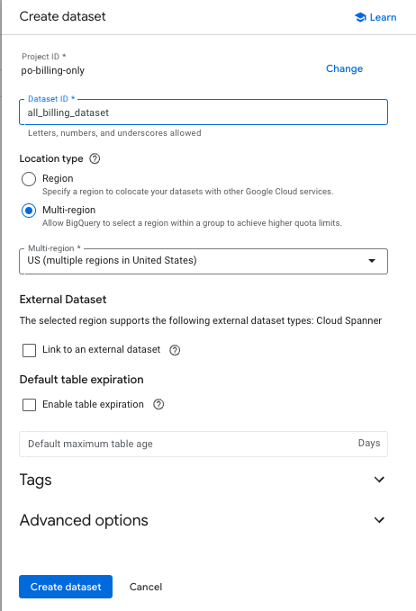
8. Click `Create Dataset`.
9. Select the dataset that was just created. 
9. Then, click `Save`
<br>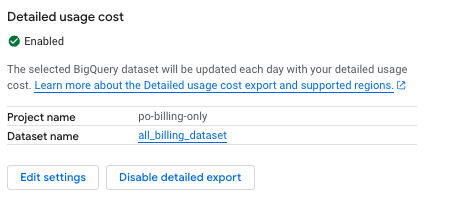

    ```
    Note: Enabling Detailed usage cost is a one-time action for the entire billing account. This setting applies to all projects under the billing account, so there is no need to enable it individually for each project.
    ```

## Generate Pricing Dataset
In the same console as above, you can create a new dataset for pricing data. This dataset will be used to store the pricing data for the resources in your GCP environment.

1. select <b>Launch GCP console</b>
2. In the Google Cloud account, select <b>Billing --> Billing Export</b>.<br>
3. Click on <b>Edit settings</b> under Pricing <br>
4. You might see a notification to enable BigQuery Data Transfer Service API. Click on the link to enable the API.
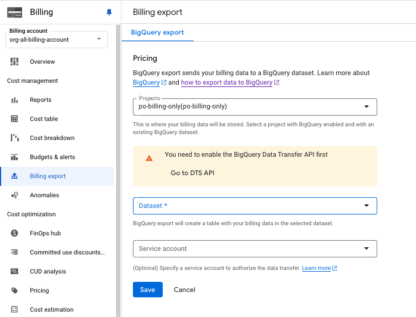
3. Select the right Project, Dataset, and the Service Account.<br>
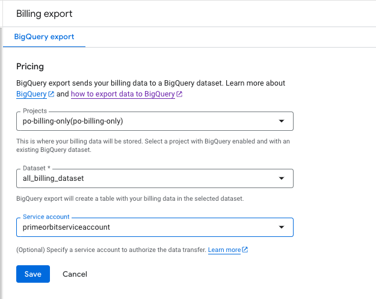
8. Click `Save`


## Generate Insights and Recommenders datasets
First, you must configure a Data Transfer for Recommender data in the Google Cloud console. You may already have completed these steps for other purposes, but confirm the steps here match what you have previously set up.

1. Go to `Recommendation Hub` --> BigQuery Export [here](https://console.cloud.google.com/active-assist/export/create?organizationId=743192096802) <br>
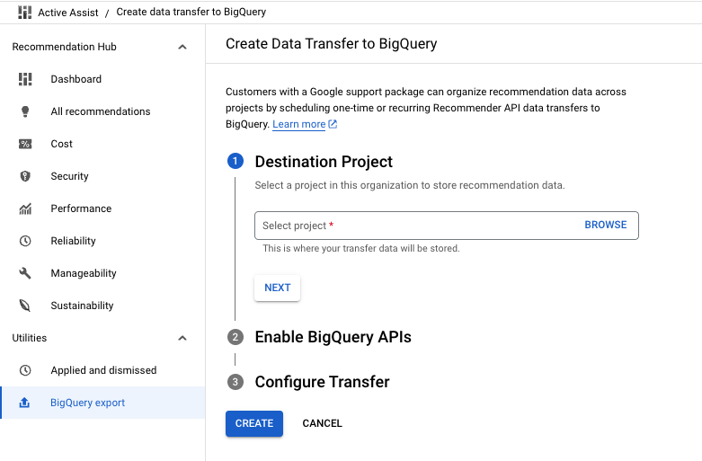
1. Set up a Data Transfer in GCP BigQuery by following the [Create a Data Transfer for Recommendations](https://cloud.google.com/recommender/docs/bq-export/export-recommendations-to-bq) instructions.
<br>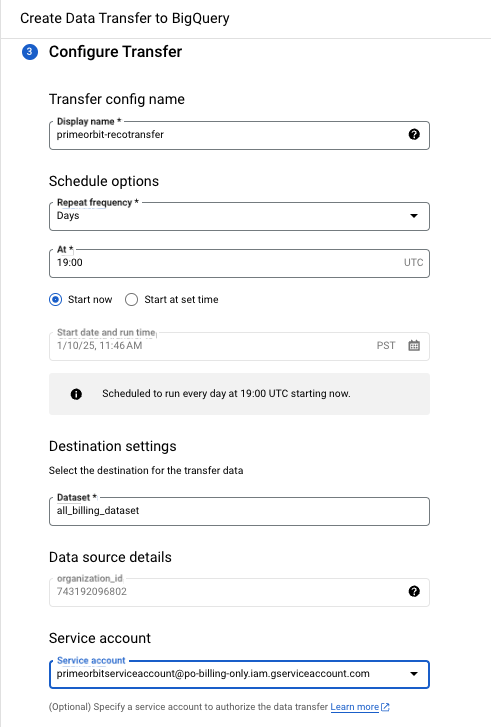
1. click on `Create`


## Configure BiqQuery Tables
1. Sign in to the Google Cloud console and go to the [BigQuery](https://console.cloud.google.com/bigquery) page.
2. Scroll down to your project <br> 
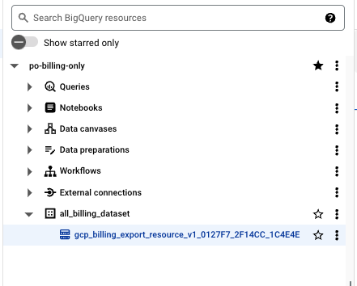
3. Identify the table name where the billing export is available. In your BigQuery dataset, the table is named `gcp_billing_export_v1_*`.
4. Once the table is accessible, make note of its fully qualified name for use in later steps. This name consists of is the Project ID, Dataset and Table name of the table you configured.
    - For example: `po-billing-only.all_billing_dataset.gcp_billing_export_resource_v1_0127F7_2F14CC_1C4E4E`
    - In that example:
        - Project ID: `po-billing-only`
        - Dataset: `all_billing_dataset`
        - Table name: `gcp_billing_export_resource_v1_0127F7_2F14CC_1C4E4E`
        - Tip: The fully qualified table name will always include the word resource. If this is missing, please reconfirm your export type is Detailed usage cost data.
4. Select the table and click `+ Share` <br>
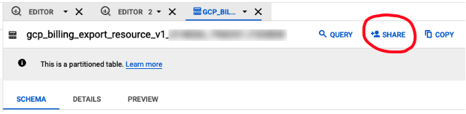
5. Click `+ Add Principal`<br>
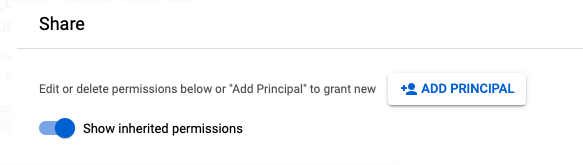
6. Add the service account and role, then click `[SAVE]`
    - Enter the following details:
        - Service Account: For Option#1 above, enter the service account email as shared by PrimeOrbit.         
        - Service Account: For Option#2 above, enter the service account email as shared by PrimeOrbit. 
            - `primeorbitserviceaccount` - the service account that was created earlier
    - Roles: `BigQuery Data Viewer`, `BigQuery Job User`, `BigQuery Read Session User`, `BigQuery Data Viewer`, `BigQuery Data Transfer Service Agent`
    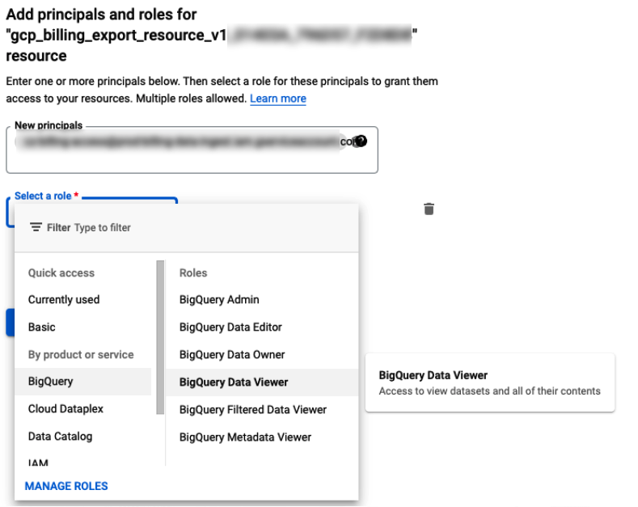
7. Click `Save`
8. Repeat the same process for `insights_export` table.
7. Repeat the same steps for the `pricing` table.
8. Repeat the same steps for the `recommendations` table.

```
First time setting up Cloud Billing exports?

If this is the first time you've setup Cloud Billing data exports in BigQuery, please be aware that it can take up to 24-48 hours for your export table to appear. It does not appear until GCP does it's first data drop, which can take a day or two. You can not continue the rest of the connection process until the table has been created.
```

## Grant Access to PrimeOrbit 
PrimeOrbit needs <u>READ ONLY</u> access to System data (no private logs or proprietary data) query Projects, Resources, Metadata, Utilization data, and Labels. In this needs be set at the Organization level (preferred) or each individual project level. 
1. Log into the GCP Console.
1. Change Scope to 'Organization' or 'Project' level.
1. Go to `IAM` --> `ALLOW`<br>
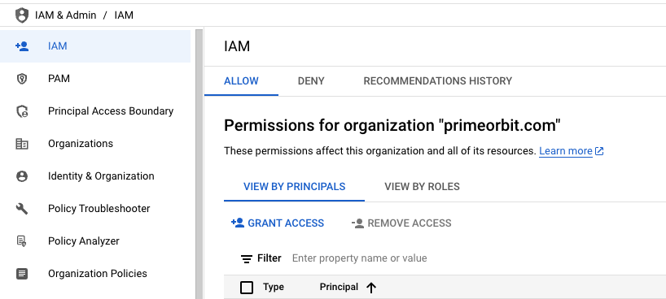
1. Click on `+ GRANT ACCESS`<br>
1. Enter the 'Service Account' email address shared by PrimeOrbit or the one created above.
1. Enter each of the following roles:
        - <b>roles/viewer</b>
        - <b>roles/recommender.viewer</b>
        - <b>roles/monitoring.viewer</b>
        - <b>roles/logging.viewer</b>
        - <b>Billing Account Usage Commitment Recommender viewer</b>
        <br>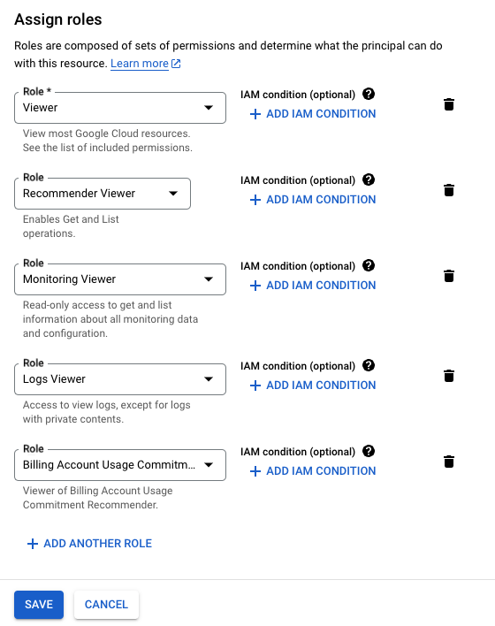
1. Click `SAVE`

## Collect the information below to share with PrimeOrbit
1. If you've picked Option#1 above, then share `JSON Key file` for the Service Account
    <br>Share the downloaded JSON file created for the Service Account.
1. Share `Billing Account ID`    
1. Share `Project ID hosting BigQuery Dataset`    
1. Share `BigQuery Dataset Name` 
1. Share `Fully Qualified Cost Report Table Name` 
1. Share `Fully Qualified Insights Table Name for Pricing` 
1. Share `Fully Qualified Insights Table Name for Recommendations` 


- For example: `po-billing-only.all_billing_dataset.gcp_billing_export_resource_v1_0127F7_2F14CC_1C4E4E`
    - Project ID: `po-billing-only6`
    - Dataset: `all_billing_dataset`
    - Table name: `gcp_billing_export_resource_v1_0127F7_2F14CC_1C4E4E`
    - Tip: The fully qualified table name will always include the word resource. If this is missing, please reconfirm your export type is Detailed usage cost data.
- JSON Key file that was previously created during Service Account creation for `primeorbitsericeaccount`
