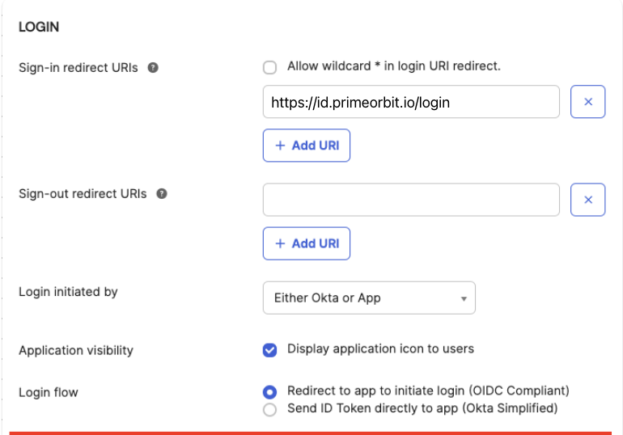
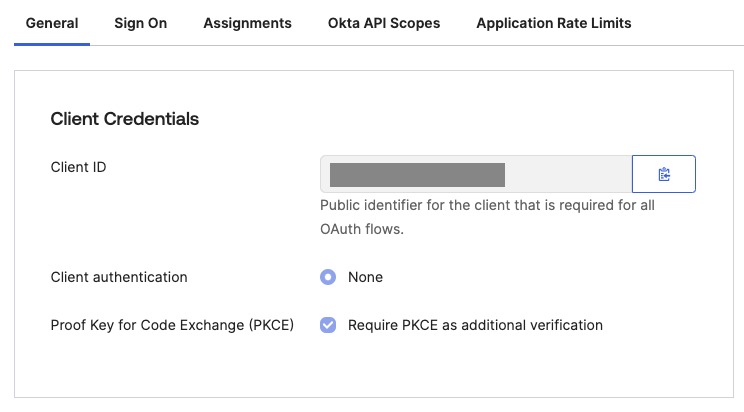

# PrimeOrbit and Okta Integration Guide

This guide provides instructions for enabling Okta as an authentication option
for your PrimeOrbit Application. Following these steps will help you integrate
Okta quickly and securely while minimizing the amount of sensitive data shared
with PrimeOrbit.

Learn more about OpenID Connect (OIDC) by referring to
[the official documentation](https://openid.net/developers/how-connect-works/).

## Supported Features

- OIDC-Based Authentication – Authenticate users using the OIDC protocol.
- Multiple OIDC Providers – Configure and manage multiple OIDC identity
  providers.

## FYI - OIDC SSO with Okta

To configure PrimeOrbit with Okta for OIDC SSO, you need to exchange required
information between your Okta application and PrimeOrbit.

## Application Creation in Okta

01. Log in to Okta and navigate to *Admin Console > Applications >
    Applications*.

02. Select *Create App* Integration.

03. Select *OIDC - OpenID Connect* as the *Sign-in* method.

04. Select *Single-Page Application*.

05. Click *Next*.

06. Enter a name (e.g., PrimeOrbit) in the App integration *name* field.

08. In the *Grant Type* field, select *Advanced*, and then check the box for
    *Implicit (hybrid)*.

09. In the *Sign-in redirect URIs* field, enter
    `https://<id>.primeorbit.io/login` where `<id>` is your company id in
    PrimeOrbit.

    

10. Click *Save* to create the app integration, then select *Edit* to configure
    additional options.

11. In the *Client Credentials* section of the *General* tab, ensure the *Proof
    Key for Code Exchange (PKCE)* box is checked.

    

12. Copy the Client ID.

13. Keep the Okta settings page open as you will need to finish configuring it
    in a later step.

## Data to share with PrimeOrbit

1. **Client Identifier**: The Client ID of the previously created Okta
   application can be found under *Client Credentials* in the *General* tab of
   the application's details in Okta. Share the client ID you copied from Okta
   into the Client ID field.
2. **Redirect URL**: Share the same URL to confirm.
3. **Enter the Issuer**: The OIDC Discovery Endpoint for your app, e.g.,
   `https://example.okta.com/.well-known/openid-configuration`. See Okta's
   documentation for more information.
4. **Enter the Issuer**: The OIDC Discovery Endpoint for your app, e.g.,
   `https://example.okta.com/.well-known/openid-configuration`. See Okta's
   [documentation](https://developer.okta.com/docs/reference/api/oidc/#well-known-openid-configuration)
   for more information.

## Testing the Integration

### Verification

1. After configuration, test the integration by initiating a login from
   PrimeOrbit.
2. Confirm that:
   1. Users are redirected to Okta for authentication.
   2. Upon successful login, users are redirected back to PrimeOrbit.
   3. Authentication tokens are correctly issued and validated, and user
      sessions are properly managed.

### Troubleshooting

1. Use Okta’s logging tools (available in the Admin Console) to review and
   diagnose any errors during the authentication process.
2. Refer to the [PrimeOrbit integration documentation](TODO) for additional
   troubleshooting tips.

## Additional Information

### Security Best Practices

Ensure that token storage, renewal, and user session management follow Okta’s
and PrimeOrbit’s security recommendations.

### Documentation and Support

For further guidance, refer to the
[Okta Documentation](https://developer.okta.com/docs/guides/) and PrimeOrbit
support resources.

## Support/Feedback

If you encounter any issues or have feedback on the integration process, please
[contact our support team](mailto:support@primeorbit.com).
