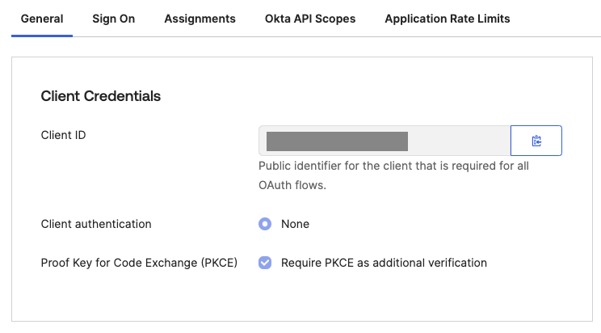
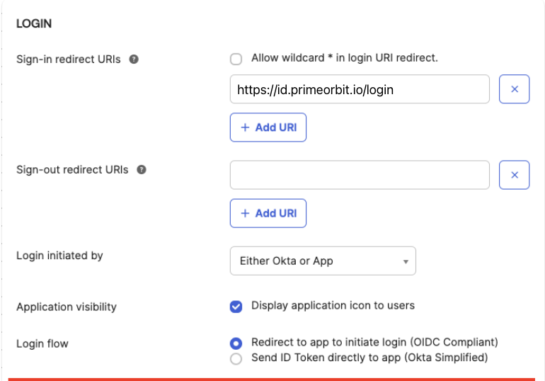

# PrimeOrbit & Okta Integration Documentation

This guide provides detailed instructions for enabling Okta as an authentication option for your PrimeOrbit Application. Following these steps will help you integrate Okta quickly and securely while minimizing the amount of sensitive data shared with PrimeOrbit.

Learn more about [OpenID Connect (OIDC)](https://openid.net/developers/how-connect-works/) by referring to the official documentation.

### Supported Features
- OIDC-Based Authentication – Authenticate users using the OIDC protocol.
- Multiple OIDC Providers – Configure and manage multiple OIDC identity providers.

---
### FYI - OIDC SSO with Okta
To configure PrimeOrbit with Okta for OIDC SSO, you need to exchange required information between your Okta application and PrimeOrbit.

## Application Creation in Okta

1. Log in to Okta and navigate to Admin Console > Applications > Applications.
1. Select Create App Integration.
1. Select OIDC - OpenID Connect as the Sign-in method.
1. Select Single-Page Application.
1. Select Next.
1. Enter a name in the App integration name field, such as PrimeOrbit.
1. Optionally, upload a logo to the Logo field. Download the PrimeOrbit logo here.
1. In the Grant type field, select Advanced, and then check the box for Implicit (hybrid).
1. In the Sign-in redirect URIs field, enter https://<id>.primeorbit.io/login
1. Click Save to create the app integration, then select Edit to configure additional options.
1. In the General tab, ensure the Proof Key for Code Exchange (PKCE) box is checked in the Client Credentials section.
1. Copy the Client ID.
1. Keep the Okta settings page open so you can finish configuring it in a later step.

## Data to share with PrimeOrbit

  1. **Client Identifier** - The Client ID of the previously created Okta application can be found under "Client Credentials" in the General tab of the application's details in Okta. Share the client ID you copied from Okta into the Client ID field.
  2. **Redirect URL** - Share the same URL to confirm.
  2. **Enter the Issuer** - This is your OIDC Discovery Endpoint (for example, `https://example.okta.com/.well-known/openid-configuration`). See Okta's documentation for more information.
  2. **Enter the Issuer** - This is your OIDC Discovery Endpoint (for example, `https://example.okta.com/.well-known/openid-configuration`). See Okta's [documentation](https://developer.okta.com/docs/reference/api/oidc/#well-known-openid-configuration) for more information.

## Testing the Integration

- **Verification:**  
  - After configuration, test the integration by initiating a login from PrimeOrbit.
  - Confirm that:
    - Users are redirected to Okta for authentication.
    - Upon successful login, users are redirected back to PrimeOrbit.
    - Authentication tokens are correctly issued and validated, and user sessions are properly managed.

- **Troubleshooting:**  
  - Use Okta’s logging tools (available in the Admin Console) to review and diagnose any errors during the authentication process.
  - Refer to the PrimeOrbit integration documentation for additional troubleshooting tips if necessary.

## Additional Recommendations

- **Review Security Best Practices:**  
  - Ensure that token storage, renewal, and user session management follow Okta’s and PrimeOrbit’s security recommendations.
  
- **Documentation and Support:**  
  - For further guidance, refer to the [Okta Documentation](https://developer.okta.com/docs/guides/) and PrimeOrbit support resources.

- **Feedback:**  
  - If you encounter any issues or have feedback on the integration process, please contact our support team.

---

By following these instructions, you can integrate Okta with PrimeOrbit effectively, ensuring secure and efficient user authentication while keeping sensitive configuration details within your control.

